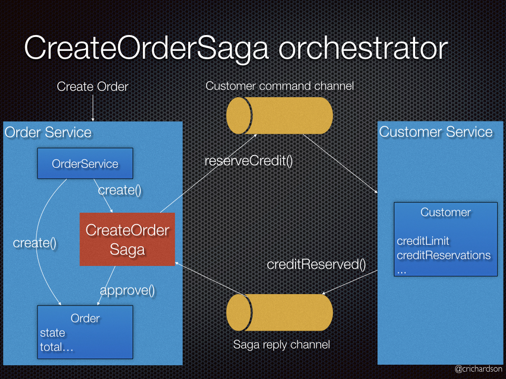

## Architecture




## Creates a kind cluster called lp-cluster
```bash
manage/create-kind-cluster.sh

test/test-kind-cluster.sh

kubectl get nodes
```

## Install all infrastructure services (Kafka, 2 Postgres, and Authorization Server)
```bash
manage/install-infrastructure-services.sh

helm search repo eventuate

helm list

kubectl get all

kubectl get secrets

# Test Kafka
test/test-kafka.sh

## Test Authorization Server
kubectl port-forward svc/authorization-server 9000:9000

test/get-jwt.sh

# Install kubeconform for MacOS
brew install kubeconform

# Test all services (api-gateway-service, customer-service, order-service)
test/validate-k8s-yaml.sh

test/test-all-services.sh

kubectl get po

kubectl describe po

kubectl logs 

kubectl get svc

kubectl get ingress

kubectl exec -it  po/customer-service-5fb9476cd6-55stj -- sh

# without ingress
kubectl port-forward svc/customer-service 8080:80

curl http://localhost:8080/actuator/health

http://localhost:8080/swagger-ui.html

# with ingress
http://localhost/swagger-ui/index.html
user/password

# Installs the Eventuate CDC and test CDC
manage/install-cdc-service.sh

helm list

# Create a customer and his order

# Use kubectl exec to run postgres in the Postgres pod and run some basic commands.
kubectl exec -it po/customer-service-postgres-0 -- sh

psql -h "customer-service-postgres" -U eventuate customer_service
password: eventuate

\d;

select * from customer;

select * from received_messages;

select * from cdc_monitoring;

exit
exit

kubectl exec -it po/order-service-postgres-0 -- sh

psql -h "order-service-postgres" -U eventuate order_service
password: eventuate

\d;

select * from orders;

select * from received_messages;

select * from cdc_monitoring;
```

## EndToEnd tests
```bash
cd application
./gradlew endToEndTestsUsingKind
```

## Undeploy services
```bash
manage/undeploy-services.sh
```

## Clean up by uninstalling all of the Helm releases
```bash
manage/uninstall-infrastructure-services.sh
```

## Delete Kind Cluster
```bash
manage/delete-kind-cluster.sh
```